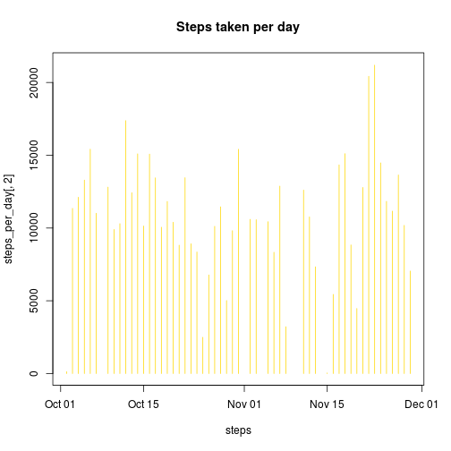
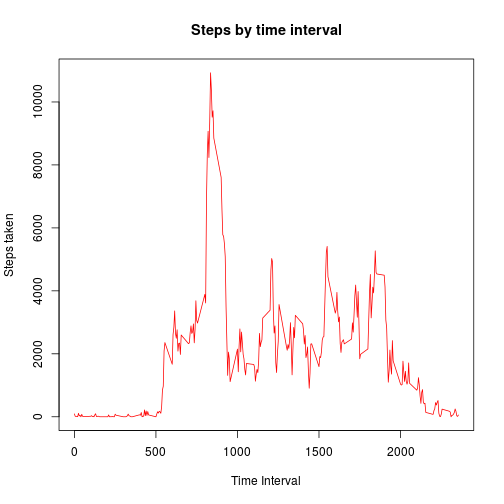
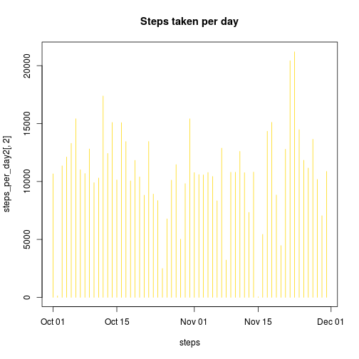
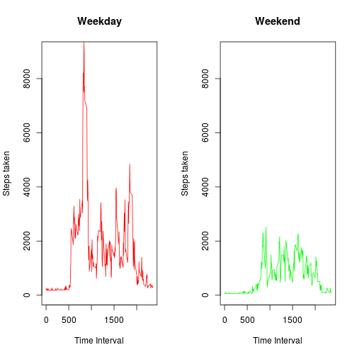

## Loading the data


```r
data <- read.table("activity.csv", sep=",", header=TRUE)
data$date <- as.Date(data$date)
```

## Computing the average number of steps per day

```r
options(scipen=999) # Removing scientific notation
totalsteps <- sum(data$steps, na.rm=TRUE)
(steps_per_day <- aggregate(steps ~ date, data=data, sum, na.rm=TRUE))
```

```
##          date steps
## 1  2012-10-02   126
## 2  2012-10-03 11352
## 3  2012-10-04 12116
## 4  2012-10-05 13294
## 5  2012-10-06 15420
## 6  2012-10-07 11015
## 7  2012-10-09 12811
## 8  2012-10-10  9900
## 9  2012-10-11 10304
## 10 2012-10-12 17382
## 11 2012-10-13 12426
## 12 2012-10-14 15098
## 13 2012-10-15 10139
## 14 2012-10-16 15084
## 15 2012-10-17 13452
## 16 2012-10-18 10056
## 17 2012-10-19 11829
## 18 2012-10-20 10395
## 19 2012-10-21  8821
## 20 2012-10-22 13460
## 21 2012-10-23  8918
## 22 2012-10-24  8355
## 23 2012-10-25  2492
## 24 2012-10-26  6778
## 25 2012-10-27 10119
## 26 2012-10-28 11458
## 27 2012-10-29  5018
## 28 2012-10-30  9819
## 29 2012-10-31 15414
## 30 2012-11-02 10600
## 31 2012-11-03 10571
## 32 2012-11-05 10439
## 33 2012-11-06  8334
## 34 2012-11-07 12883
## 35 2012-11-08  3219
## 36 2012-11-11 12608
## 37 2012-11-12 10765
## 38 2012-11-13  7336
## 39 2012-11-15    41
## 40 2012-11-16  5441
## 41 2012-11-17 14339
## 42 2012-11-18 15110
## 43 2012-11-19  8841
## 44 2012-11-20  4472
## 45 2012-11-21 12787
## 46 2012-11-22 20427
## 47 2012-11-23 21194
## 48 2012-11-24 14478
## 49 2012-11-25 11834
## 50 2012-11-26 11162
## 51 2012-11-27 13646
## 52 2012-11-28 10183
## 53 2012-11-29  7047
```

```r
plot(steps_per_day[,1], steps_per_day[,2], type="h", xlab="steps", 
     main="Steps taken per day", col="gold")
```

 

```r
spdmean <- mean(steps_per_day[,2])
spdmedian <- median(steps_per_day[,2])
```
The total number of steps taken is 570608. 
The mean number of steps per day is 10766.19, while the median is 
10765. 

## Analyzing steps taken by time interval

```r
steps_by_interval <- aggregate(steps ~ interval, data=data, sum, na.rm=TRUE)
plot(steps_by_interval[,1], steps_by_interval[,2], type="l", col="red", 
     xlab="Time Interval", ylab= "Steps taken", main="Steps by time interval")
```

 

```r
best_interval <- steps_by_interval[,1][which.max(steps_by_interval[,2])]
```

The time interval on which more steps were taken (corresponding to the peak in
the time series plot) is the interval "835".

## Imputing missing data

```r
sum(!complete.cases(data))
```

```
## [1] 2304
```

```r
fit <- lm(steps ~ date + interval, data=data)

imputations <- predict(fit, data[!complete.cases(data),])
data2 <- data
data2[!complete.cases(data2),1] <- imputations

sum(!complete.cases(data2))
```

```
## [1] 0
```

```r
(steps_per_day2 <- aggregate(steps ~ date, data=data2, sum))
```

```
##          date    steps
## 1  2012-10-01 10662.74
## 2  2012-10-02   126.00
## 3  2012-10-03 11352.00
## 4  2012-10-04 12116.00
## 5  2012-10-05 13294.00
## 6  2012-10-06 15420.00
## 7  2012-10-07 11015.00
## 8  2012-10-08 10687.11
## 9  2012-10-09 12811.00
## 10 2012-10-10  9900.00
## 11 2012-10-11 10304.00
## 12 2012-10-12 17382.00
## 13 2012-10-13 12426.00
## 14 2012-10-14 15098.00
## 15 2012-10-15 10139.00
## 16 2012-10-16 15084.00
## 17 2012-10-17 13452.00
## 18 2012-10-18 10056.00
## 19 2012-10-19 11829.00
## 20 2012-10-20 10395.00
## 21 2012-10-21  8821.00
## 22 2012-10-22 13460.00
## 23 2012-10-23  8918.00
## 24 2012-10-24  8355.00
## 25 2012-10-25  2492.00
## 26 2012-10-26  6778.00
## 27 2012-10-27 10119.00
## 28 2012-10-28 11458.00
## 29 2012-10-29  5018.00
## 30 2012-10-30  9819.00
## 31 2012-10-31 15414.00
## 32 2012-11-01 10770.65
## 33 2012-11-02 10600.00
## 34 2012-11-03 10571.00
## 35 2012-11-04 10781.10
## 36 2012-11-05 10439.00
## 37 2012-11-06  8334.00
## 38 2012-11-07 12883.00
## 39 2012-11-08  3219.00
## 40 2012-11-09 10798.50
## 41 2012-11-10 10801.98
## 42 2012-11-11 12608.00
## 43 2012-11-12 10765.00
## 44 2012-11-13  7336.00
## 45 2012-11-14 10815.91
## 46 2012-11-15    41.00
## 47 2012-11-16  5441.00
## 48 2012-11-17 14339.00
## 49 2012-11-18 15110.00
## 50 2012-11-19  8841.00
## 51 2012-11-20  4472.00
## 52 2012-11-21 12787.00
## 53 2012-11-22 20427.00
## 54 2012-11-23 21194.00
## 55 2012-11-24 14478.00
## 56 2012-11-25 11834.00
## 57 2012-11-26 11162.00
## 58 2012-11-27 13646.00
## 59 2012-11-28 10183.00
## 60 2012-11-29  7047.00
## 61 2012-11-30 10871.61
```

```r
plot(steps_per_day2[,1], steps_per_day2[,2], type="h", xlab="steps", 
     main="Steps taken per day", col="gold")
```

 

```r
spdmean2 <- mean(steps_per_day2[,2])
spdmedian2 <- median(steps_per_day2[,2])
```
I decided to impute missing data by linear prediction. Both the day and the
time interval are used as predictors of the number of steps taken. This should
impute values quite similar in distribution to those regularly observed. 

We can see that the mean of the new dataset (with missing data imputed) is 
10767.17, and its median 10781.1. The difference between these statistics
and those computed on the original dataset are, respectively, -0.99
and -16.1. 

## Analyzing activity patterns in weekdays and weekends

```r
Sys.setlocale("LC_TIME", "C") # Necessary to have weekdays in english
```

```
## [1] "C"
```

```r
wd <- weekdays(data2$date)
data2$weekday <- (wd == "Saturday" | wd == "Sunday")
data2$weekday <- factor(data2$weekday, levels=c(TRUE, FALSE), 
                        labels=c("weekend", "weekday"))

steps_by_interval2 <- aggregate(steps ~ interval + weekday, data=data2, sum, 
                                na.rm=TRUE)

par(mfrow=c(1, 2))
plot(steps_by_interval2[steps_by_interval2$weekday == "weekday",1], 
     steps_by_interval2[steps_by_interval2$weekday == "weekday",3], type="l", 
     col="red", xlab="Time Interval", ylab= "Steps taken", 
     main="Weekday", ylim=c(0,9000))

plot(steps_by_interval2[steps_by_interval2$weekday == "weekend",1], 
     steps_by_interval2[steps_by_interval2$weekday == "weekend",3], type="l", 
     col="green", xlab="Time Interval", ylab= "Steps taken", 
     main="Weekend", ylim=c(0,9000))
```

 

We can see that steps taken in the weekend and steps taken in weekdays follow
very different patterns. 
